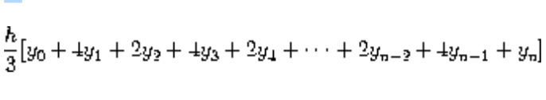

class: center, middle, inverse

# Functional Programming
### Ayush Goel

---

.left-column[
### Disclaimer
]
.right-column[
* I am not a functional programmer in "authentic" terms. Most of my knowledge comes from doing exercises of SICP and discussing them with people here.
* Scheme is not my everyday choice of languages, thus, stack overflow might help you debug better than me.
]

---
class: center, middle, inverse

# Day 1

---

.left-column[
### What?
]

--

.right-column[
###Wiki

> Functional programming is a programming paradigm — a style of building the structure and elements of computer programs — that treats computation as the evaluation of mathematical functions and avoids changing-state and mutable data.
]

--

.right-column-continued[
* Keywords:
  - paradigm, just like imperative is
  - computation as mathematical functions
  - avoid mutable data
]

---

.left-column[
### What makes it possible?
]

--

.right-column[
1. ### Immutable data
]

--

.right-column-continued[
* An immutable piece of data is one that cannot be changed. Duh!
]

---

```
class Vehicle:
  def __init__(self):
    self.petrol = 2

  def description(self):
      desc_str = "I have {0} liters of petrol".format(self.petrol)
      return desc_str
```

--

* `petrol` is immutable right now and can as well be a constant.
* But this isn't how we code (or use a vehicle), right?

---

```
class Vehicle:
  def __init__(self):
    self.petrol = 2

  def addPetrol(self, p):
    self.petrol += p

  def usePetrol(self, p):
    self.petrol -= p

  def description(self):
      desc_str = "I have {0} liters of petrol".format(self.petrol)
      return desc_str
```

--

* Yes, this looks more like a vehicle.

* `petrol` can change at any time
  * anyone can change it

* And now we have mutable state in our Vehicle!

---
class: center, middle, inverse

# 😡
## Mutability

---

.left-column[
### Why 😡 Mutability?
]

--

.right-column[
> There are only two hard things in Computer Science: cache invalidation and naming things. -- Phil Karlton

]

--

.right-column[
* In our example of Vehicle, The petrol tank has a sensor of the actual amount of petrol in the vehicle. That is the true value of petrol.
* To map the real world in our objects, we have cached the value of petrol (For easier and faster access) in our class object.
]

--

.right-column-continued[
* Concurrency is much easier with immutable data since no locking is required
]

--

.right-column-continued[
* Code is easier to understand since two code flows using same data would act independently
]

---

.left-column[
### Why 😡 Mutability?
]

.right-column[
Some languages, like .red[Clojure], make all values immutable by default.

Any “mutating” operations copy the value, change it and pass back the changed copy.
]

---

.left-column[
### What makes it possible?
]

--

.right-column[
1. ### Immutable data
2. ### Functions as first class citizens
]

--

.right-column-continued[
* Allow functions to be treated like any other value
  - Created
  - Passed to functions
  - Returned from functions and
  - Stored inside data structures
]

--

.right-column-continued[
* Let's introduce lambdas
]

---

.left-column[
### Lambdas
]

--

.right-column[
* Also known as anonymous function, function literal, lambda abstraction, or lambda expression
* It is a function definition that is not bound to an identifier.
* Usually used as return values from functions.
]

---

.left-column[
### Pure functions
]

--

.right-column[
* Functions that don't change output based on environment.
]
--

.right-column[
* You can also think of them as functions with no side effects.

  A function has some side effect if it modifies state outside its scope or has observable interaction with outside world.
]
--

.right-column[
* Think of them as mathematical functions instead of computational.
]

---

.left-column[
### Pure functions
]

.right-column[

```
(define (mult2 x)
  (* 2 x))
```
----
```python
a = 0
def increment():
  global a
    a += 1
```
``` python
def increment(a):
  return a + 1

```
]

---

.left-column[
### Higher order functions
]

--

.right-column[
* Functions that either take a function as parameter or return a function as a parameter
* Eg:
   ```
    (define (map f arr)
      (if (null? arr)
        '()
        (cons (f (car arr))
              (map f (cdr arr)))
      ))
    ```

    ```
    > (map mult2 (cons 2 (cons 4 '()))) ; [4 8]
    ```

]

---

.left-column[
### Tail call optimisation
]

.right-column[
Tail-call optimization (or tail-call merging or tail-call elimination) is a generalization of TailRecursion:

> If the last thing a routine does before it returns is call another routine, rather than doing a jump-and-add-stack-frame immediately followed by a pop-stack-frame-and-return-to-caller, it should be safe to simply jump to the start of the second routine, letting it re-use the first routine's stack frame (environment).


]

---

.left-column[
### Tail call optimisation
]

.right-column[

###Non tail recursive

```scheme
(define (factorial x)
  (if (zero? x)
    1
    (* x (factorial (- x 1))))
```

###Tail recursive

```scheme
(define (factorial x acc)
  (if (zero? x)
    acc
    (factorial (sub1 x)
               (* x acc))))
```

]

---

.left-column[
### Advantages of Functional Programming
]

--

.right-column[
1. **Concurrent execution** - since pure functions have no side effects, they can run in parallel without synchronization. These concurrent processes are often run on multiple processors.

2. **Determinism** - A process is deterministic if repetitions yield the same result every time.
  1. And thus, **testability** is super easy - Remember how each test requires an environment setup for running with mocks stubs doubles etc etc. That is not required with pure functions since functions depend only on parameters passed to them (instead of probing the environment they are in)

]

---

.left-column[
### Ease in Testing
]

.right-column[
#### Example

from: [QuickCheck manual](http://www.cse.chalmers.se/~rjmh/QuickCheck/manual.html)

QuickCheck is a tool for testing Haskell programs automatically.

* The programmer provides a specification of the program
* QuickCheck then tests that the properties hold in a large number of randomly generated cases

]

---

.right-column[

A simple example of a property definition is

```
prop_RevRev xs = reverse (reverse xs) == xs
  where types = xs::[Int]
```

To check the property, we load this definition in to hugs and then invoke

```
Main> quickCheck prop_RevRev
OK, passed 100 tests.
```

When a property fails, QuickCheck displays a counter-example. For example, if we define

```
prop_RevId xs = reverse xs == xs
  where types = xs::[Int]
```

then checking it results in

```
Main> quickCheck prop_RevId
Falsifiable, after 1 tests:
[-3,15]
```
]

---

.left-column[
### Declarative Thinking
]

.right-column[

> Declarative programming is writing code in a way that describes what you want to do and not how you want to do it.

In essence it's just writing your code top down instead of bottom up.

.red[Do Wishful Thinking]
]

---

.left-column[
### Declarative Thinking
]

.right-column[

Imagine writing a function for `f(x) = 2*x + x^2`

```text
         f(x)
          ^
          |
    +---> + <---+
    +           +
Double(x)    Square(x)
```

#### Declarative thinking is all about writing `f(x)` before `Double` and `Square`

Just wish that they exist..
]

---

class: center

#### Functional code is characterised by one thing:
# the absence of side effects

--

It doesn’t rely on data outside the current function,

--

and it doesn’t change data that exists outside the current function.

--

Every other “functional” thing can be derived from this property.

---
class: center, middle, inverse

# Day 2

---

.left-column[
 ### Prerequisite
]
.right-column[
  * mit-scheme installed?
]
--

.right-column[
  * Some topics would require hands-on exercises.

     We will be doing a [roulette spin](http://wheeldecide.com/index.php?c1=Pratyush&c2=Prashant&c3=Imamudin&t=Who+solves+this%21&time=5) to decide who is going to do it on projector.
]

---

.left-column[
 ### Code
]

.right-column[
* Mostly, recursion will solve everything
]

--
.right-column[
* Try and think about functions as first class functions i.e. they can be passed around and treated just like variables.
]

--
.right-column[
* Scheme doesn't allow having state (it kinda does, but we will ignore that part). It will take some time to get your head around it.
]

--
.right-column[
* Use the [reference](http://www.nada.kth.se/kurser/su/DA2001/sudata16/examination/schemeCheatsheet.pdf) when in doubt
]

--
.right-column[
* It is easy!
]

---

## Identity

#### (idn 2) -> 2

--

```scheme
(define (idn x) x)
```

```scheme
(define (idn x)
  x
)
```

---

## Max/Min

#### (max 2 3) -> 3
#### (min 2 3) -> 2

.small.dark-gray[consider only two arguments]

--

```scheme
(define (max a b)
  (if (> a b)
      a
      b))

> (max -2 -5) ; -2
```

---

## Prepend

#### (prepend 2 '(0 1)) -> (2 0 1)

--

```scheme
(define prepend cons)

> (prepend 2 '(0 1));  (2 0 1)
```

---

## Append

#### (append 2 '(0 1)) -> (0 1 2)

.footnote.small[What is difference between [quote-and-list](https://stackoverflow.com/questions/34984552/what-is-the-difference-between-quote-and-list)]
--

```scheme
(define (append x arr)
  (cond ((null? arr)
            (list x)) ; check footnote
        (else (cons
                (car arr)
                (append x (cdr arr))))
  )
)

(append 2 '())
(append 2 '(1))
(append 2 '(0 1))

```

---

## Length of list

#### (length '(1 2 3 4)) -> 4

--

```scheme
(define (length arr)
  (if (null? arr)
      0
      (+ 1 (length (cdr arr)))))

(length '())
(length '(1))
(length '(0 1))
```

---

## Reverse a list

#### (reverse '(0 1)) -> (1 0)

.small.dark-gray[Remember to handle the null at end of list]

--

```scheme
(define (reverse-helper arr acc)
  (if (null? arr)
      acc
      (reverse-helper ; Notice how this is tail recursive
        (cdr arr)
        (cons (car arr)
              acc)
      )
  )
)

(define (reverse arr)
  (reverse-helper arr '()))

(reverse '(0 1))
(reverse '(0 1 2 3 4))
```

---

## Zip 2 lists

#### (zip '(1 2) '(4 5)) -> '((1 4) (2 5))

--

```scheme
(define (zip arr1 arr2)
  (if (or (null? arr1) (null? arr2))
      '()
      (list (list (car arr1) (car arr2)) (zip (cdr arr1) (cdr arr2)))
))
```

---

## Simposon's rule for integration

#### The integral of a function `f` between a and b is approximated as
```
 h = (b - a)/n
 y(k) = f(a + kh)
```

.left[]

--

```scheme
(define (simpson-integral f a b n)
  (define (h) (/ (- b a) n))
  (define (y k) (f (+ a (* k (h)))))
  (define (sum i crntsum)
    (cond ((= i 0) (sum 1 (y i)))
          ((= i n) (+ crntsum (y i)))
          ((even? i) (sum (+ i 1) (+ crntsum (* 2 (y i)))))
          (else (sum (+ i 1) (+ crntsum (* 4 (y i)))))))
  (* (/ (h) 3)
     (sum 0 0))
  )
(define (cube x) (* x x x))
(simpson-integral cube 0 1 10)
```

---

class: center, middle, inverse

## Higher Order Functions

---

## Map

#### Given a list create another list with function `f` applied to all elements

--

```scheme
(define (mapx f arr)
  (if (null? arr)
      '()
      (cons (f (car arr))
            (mapx f (cdr arr)))
  )
)

(define (add2 x) (+ x 2))
(mapx add2 (cons 2 '()))
(mapx add2 (cons 2 (cons 3 '())))
```

---

## Filter

#### Given a list L create another list with elements from L only if `f` returns `#t` for it

--

```scheme
(define (filterx f arr)
  (if (null? arr)
    '()
    (if (f (car arr))
      (cons (car arr) (filterx f (cdr arr)))
      (filterx f (cdr arr))
    )
  )
)

(filterx even? (cons 1 (cons 2 (cons 3 (cons 4 '())))))
(filterx even? '(1 2 4 5 3 6 8 7 9 1212))

```

---

## Reduce/ foldl

#### Applies a function against an accumulator and each element in the array (from left to right) to reduce it to a single value.

(reduce + 0 '(1 2 3)) -> 6

--

```scheme
(define (reducex initial f arr)
  (if (null? arr)
      initial
      (reducex (f initial (car arr)) f (cdr arr))))

(define (a3 ini val) (+ ini val))
(reducex 0 a3 (cons 2 (cons 3 '())))
(reducex 10 a3 (cons 2 (cons 3 '())))
(reducex 0 - '(1 2 3))
```

.footnote.red[There are 4 variations of fold. 2 with going from left to right. 2 with `f` taking accumulator as first value or second.]

---

## Pipelining

#### Just like `fold`, but instead a list of functions is passed in. A single value is passed to each function to derive a single value.

(define (mul2 x) (* 2))
(pipeline '(abs mul2) -2) -> 4

--

```scheme
(define (pipelinex funcs x)
  (if (null? funcs)
    x
    (pipelinex (cdr funcs) ((car funcs) x))
  )
)

(define (mult2 x)
  (* x 2))
(pipelinex (cons abs (cons mult2 '())) 2)
(pipelinex (cons abs (cons mult2 '())) -2)
```

---

## Compose

#### Given a list of functions, create a function that is a composition of all the functions given in order

--

```scheme
(define (composex funcs)
  (lambda (x)
    (reducex '() (lambda (ini f) (f x))
      funcs)
  )
)

(define absmult2 (composex (cons abst (cons mult2 '()))))
(absmult2 2)
(absmult2 -2)
```

---

## Currying

#### Given a function `f` with n parameters, a curried function `f'` would do the same work with (n-1) parameters.

Think of this as adding state to functions.

```swift
func add(a: Int, b: Int) -> Int {
  return a + b
}

func add(a: Int)(b: Int) -> Int { // curried
  return a + b
}

let addTwo = add(2)
```

---

## Currying

#### Given a function `f` with n parameters, a curried function `f'` would do the same work with (n-1) parameters.

Think of this as adding state to functions.

```scheme
(define curry2
  (lambda (f)
    (lambda (arg1)
     (lambda (arg2)
       (f arg1 arg2)))
  ))
(define addTwoNums (curry2 +))
(define add2 (addTwoNums 2))
(add2 3)
```

---

##  What to do on last day?

1. More of programming exercises
2. A talk that defines the requirement of going functional in the face of OOP based languages by Rich Hickey.

---

class: center, middle, inverse

# Day 3

---
class: center, middle, inverse

##[Are we there yet?](http://www.infoq.com/presentations/Are-We-There-Yet-Rich-Hickey)

Rich Hickey, creator of Clojure

---
class: center, middle, inverse

## Before closing....

---

.left-column[
###  Interested in more?
]

.right-column[
1. I can have a future advanced session which has data abstractions, benefits and costs of assignment, streams and more examples.
2. We can start a group for reading and solving exercises of SICP
]

.footnote.red[None of this is required, I am just saying this because I have to...]

---
class: center, middle

## Praise the lord!

--

#### and me...

--

##### because appraisals aren't far 😉


---

class: center, middle

## Share your feedback!
# 🙏
Write to me or catch me where you see me.

.red[\#please]

---

class: center, middle

### Let me know in case you ACTUALLY go and use this stuff!


---
class: center, middle

### This presentation is available on
#### https://github.com/ayushgoel/presentations/tree/master/FunctionalProgramming

---

class: center, middle, inverse

# Thank you!

### I couldn't have hoped for a better audience. You people are awesome.
