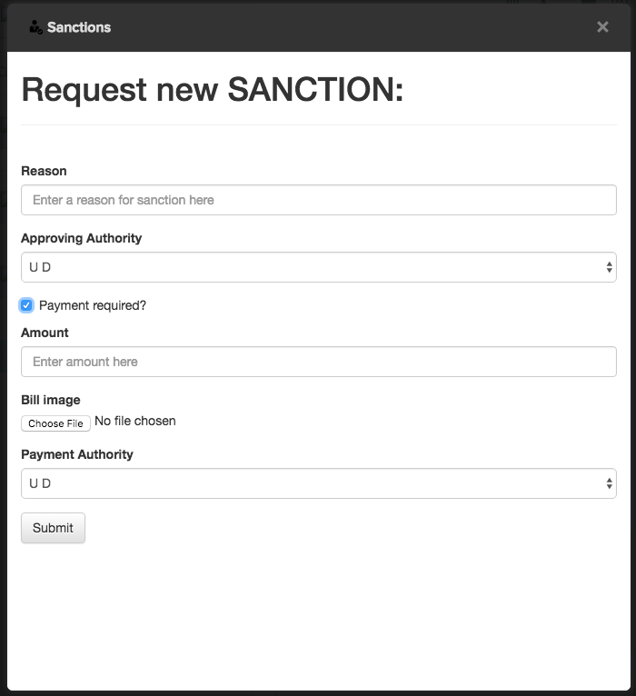
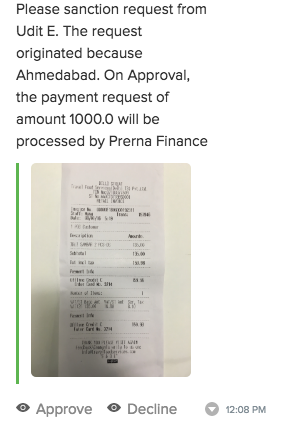
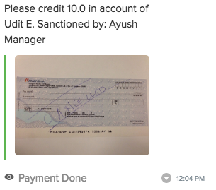
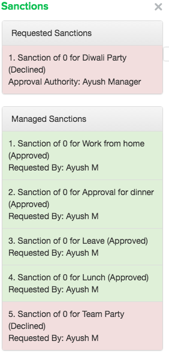

class: center, middle

# Sanctions
### Approvals + Reimbursements

---
class: center, middle

# Approvals

### Leave
### Work from Home
### Expenses

---
class: center, middle

# Reimbursements

### Travel
### Food Expenses
### Services

---
class: middle

##Usual flow for Approval/Reimbursements:

###1. Send mail to your manager with CC to some handler in case of reimbursement.
###2. Manager responds to the mail with approval.
###3. The task handler creates a GT with the above two mails.

---
class: middle

###4. The GT is assigned to someone in accounts.
###5. Wait for eternity.
###6. Check bank account. Thank god if money transferred or go back to step 5.

---
class: center, middle

###Approvals are not so pesky if manager (approving person) is quick.
###But mails tend to slip through other stuff and then you are required to send reminder mails.

---
class: center, middle

#Enter Sanctions 🎉

---
class: center, middle

#Create a Approval/Reimbursement request from any chat screen.

---
class: center, middle

# An Approval request is sent to the chosen manager.

---
class: center, middle

# Once the manager approves, a reimbursement request is sent to the accounts person.

---
class: center, middle

# At any time you can see the status of your reimbursements in the launcher extension.

---
class: center, middle

# No more GT required.
# You can track your reimbursements more easily.
# All in one place, Flock! 🖖

---
class: center, middle

# Demo
